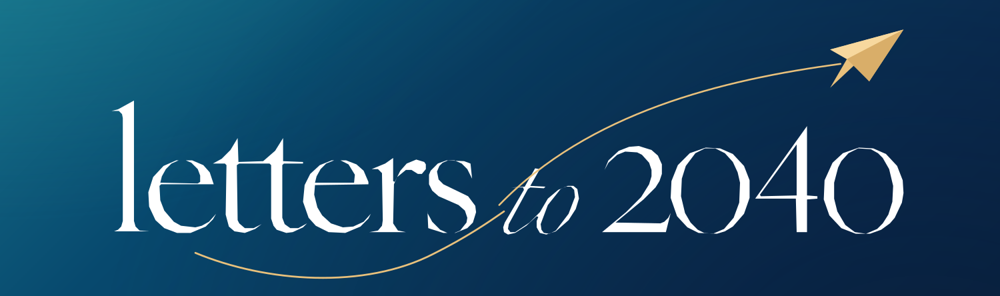

# Decision Log — Letters to 2040

This file records meaningful creative and product decisions.

The goal is not bureaucracy. It is to make the reasoning behind the project visible.

---

## Template

### Decision XX — Title

**Date:** YYYY-MM-DD

**Context**  
What problem or tension existed?

**Options considered**
- Option A
- Option B
- Option C

**Evidence**  
Research, testing, constraints or observations that informed the choice.

**Decision**  
What did we choose?

**Trade-off**  
What did we knowingly give up?

**Follow-up**  
What should be tested or revisited later?

---

## Decision 01 — Make the process public

**Date:** 2026-09-21

**Context**  
The project is intended to demonstrate leadership, communication, creativity and decision-making, not only a polished final website.

**Options considered**
- Publish only the finished experience.
- Publish the experience plus selected case-study material.
- Document the project process openly from the beginning.

**Evidence**  
The value of the project depends on showing how ambiguity becomes direction: research, briefs, collaboration, feedback and trade-offs.

**Decision**  
Document the process openly in the repository.

**Trade-off**  
The project will expose unfinished thinking and changes in direction.

**Follow-up**  
Keep documentation concise enough that it supports the work instead of becoming the work.

---

## Decision 02 — Adopt the supplied blue-and-gold identity

**Date:** 2026-09-24

**Context**  
The existing interactive prototype and README used a multi-color experimental palette that did not reflect the newly approved Letters to 2040 artwork.

**Options considered**
- Retain the original experimental palette.
- Use the supplied editorial lettering and gold flight motif as a standalone decorative logo only.
- Establish the approved navy / teal / gold direction across the logo, README, documentation and experience.

**Evidence**  
The approved asset supplied for this update establishes a distinctive wordmark, golden paper plane and a clear blue-to-midnight visual language. Site and repository visuals should represent one project.

**Decision**  
Adopt the supplied artwork as the project's visual identity. Add reusable local vector adaptations and a single brand guide. Keep the interactive question, bilingual copy, local-only drafts and reduced-motion behavior intact.

**Trade-off**  
A more restrained palette replaces the playful rainbow treatment. Existing code-generated SVG vectors are adaptations; future print or launch exports should reference the supplied full-resolution master.

**Follow-up**  
Review the experience on desktop and mobile, including contrast, reduced-motion behavior and the readability of the compact logo.
